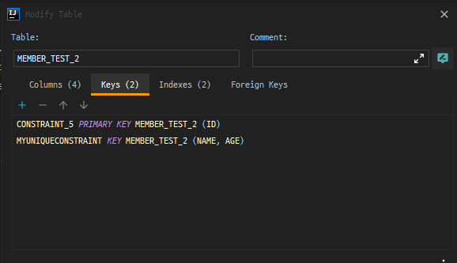
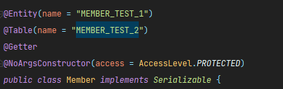
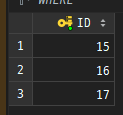
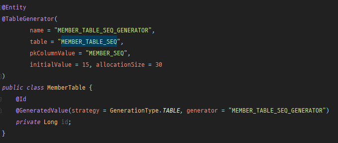

### 데이터베이스 스키마 자동 생성

JPA는 스키마를 자동으로 생성하는 기능을 지원한다.

```
spring:  
  jpa:
    hibernate:
      ddl-auto: create // create-drop, update, validate, none(default)
```

이 설정을 추가하면 애플리케이션 실행 시점에 데이터베이스 테이블을 자동으로 조건에 맞게 생성, 수정, 검증 등 작업을 해준다.

<table style="border-collapse: collapse; width: 100%;" border="1" data-ke-align="alignLeft" data-ke-style="style13"><tbody><tr><td style="width: 20%;">옵션</td><td style="width: 80%;">설명</td></tr><tr><td style="width: 20%;">create</td><td style="width: 80%;">기존 테이블을 삭제하고 새로 생성한다. DROP + CREATE</td></tr><tr><td style="width: 20%;">create-drop</td><td style="width: 80%;">create 속성에 추가로 애플리케이션을 종료할 때 생성한 DDL을 제거한다. DROP + CREATE + DROP</td></tr><tr><td style="width: 20%;">update</td><td style="width: 80%;">데이터베이스 테이블과 엔티티 매핑정보를 비교해 변경사항만 수정한다.</td></tr><tr><td style="width: 20%;">validate</td><td style="width: 80%;">데이터베이스 테이블과 엔티티 매핑정보를 비교해서 차이가 있으면 경고를 남기고 애플리케이션을 실행하지 않는다.&nbsp; DDL을 수정하지 않음</td></tr><tr><td style="width: 20%;">none (default)</td><td style="width: 80%;">자동 생성기능을 사용하지 않는다. (참고로 none은 유효하지 않은 옵션값)</td></tr></tbody></table>


### JPA 대표 애노테이션

-   객체와 테이블 매핑 : @Entity, @Table
-   기본 키 매핑 : @Id
-   필드와 컬럼 매핑 : @Column
-   연관관계 매핑 : @ManyToOne, @JoinColumn

---

### 객체와 테이블 매핑

#### @Entity

JPA를 사용해서 테이블과 매핑할 클래스는 @Entity 애노테이션을 필수로 붙여야 한다.

<table style="border-collapse: collapse; width: 100%;" border="1" data-ke-align="alignLeft" data-ke-style="style13"><tbody><tr><td style="width: 20%;">속성</td><td style="width: 50%;">기능</td><td style="width: 30%;">기본값</td></tr><tr><td style="width: 20%;">name</td><td style="width: 50%;">JPA에서 사용할 엔티티 이름 지정</td><td style="width: 30%;">설정하지 않으면 클래스 이름 그대로 사용</td></tr></tbody></table>

-   기본생성자는 필수
-   final 클래스, enum, interface, inner 클래스 사용 불가
-   필드에 final 사용 불가


#### @Table

엔티티와 매핑할 테이블 이름을 지정할 때 사용

<table style="border-collapse: collapse; width: 100%; height: 100px;" border="1" data-ke-align="alignLeft" data-ke-style="style13"><tbody><tr style="height: 20px;"><td style="width: 20%; height: 20px;">속성</td><td style="width: 50%; height: 20px;">기능</td><td style="width: 30%; height: 20px;">기본값</td></tr><tr style="height: 20px;"><td style="width: 20%; height: 20px;">name</td><td style="width: 50%; height: 20px;">매핑할 테이블 이름</td><td style="width: 30%; height: 20px;">엔티티 이름을 사용</td></tr><tr style="height: 20px;"><td style="width: 20%; height: 20px;">catalog</td><td style="width: 50%; height: 20px;">catalog 기능이 있는 DB에 catalog를 매핑</td><td style="width: 30%; height: 20px;">&nbsp;</td></tr><tr style="height: 20px;"><td style="width: 20%; height: 20px;">schema</td><td style="width: 50%; height: 20px;">schema 기능이 있는 DB에 schema를 매핑</td><td style="width: 30%; height: 20px;">&nbsp;</td></tr><tr style="height: 20px;"><td style="width: 20%; height: 20px;">uniqueConstaint</td><td style="width: 50%; height: 20px;">DDL 생성 시 유니크 제약조건 생성</td><td style="width: 30%; height: 20px;">&nbsp;</td></tr></tbody></table>

-   @Table에 name 지정


-   @Table에 uniqueConstraints 지정





#### @Entity와 @Table 동시에 name을 붙였을 경우

@Entity의 name은 순수하게 entity의 이름을 지정하는 것이고 @Table의 name은 DB와 매핑할 테이블 이름을 설정하는 것이다.  즉, 실제로 테이블과 직접적으로 매핑되는 속성은 @Table이므로 둘 다 지정한 경우에는 @Table의 name으로 DB 테이블이 생성된다.




> @Entity와 @Table에 name을 지정하여 테이블 이름을 정할 수 있다.  하지만 처음 시도했을 때 대문자로 name을 줘도 소문자로 입력되는 경우를 볼 수 있는데 이때는 yml에 설정값을 다음과 같이 추가해야한다.
>
> ```
> datasource:   
>   hibernate:
>     naming:
>       physical-strategy: org.hibernate.boot.model.naming.PhysicalNamingStrategyStandardImpl​
> ```
>
> 그러면 정상적으로 대문자로 입력이 된다.

---

### 기본 키 매핑

기본 키를 매핑할 때는 @Id를 사용한다.  그리고 위에서의 예제들 모두 @Id를 사용해 기본키를 매핑했다.  단순히 @Id만 사용하는 경우 사용자가 기본키를 직접 할당해 주어야하지만 데이터베이스가 생성해 주는 값을 할당하기 위해서 추가 옵션이 필요하다.

-   IDENTITY : 기본 키 생성을 데이터베이스에 위임
-   SEQUENCE : 데이터베이스 시쿼스를 사용해서 기본 키를 할당
-   TABLE : 키 생성 테이블을 사용

자동 생성 전략이 이렇게 다양한 이유는 DB 벤더마다 지원하는 방식이 다르기 때문에다.  예를 들어 오라클은 시쿼스를 제공하지만 MySql은 제공하지 않는다.

> 키 생성 전략을 사용하려면 아래 옵션을 추가해줘야 한다.
>
> ```
> spring:
>   jpa:
>     properties:
>       hibernate:
>         use-new-id-generator-mappings: true​​
> ```

#### 기본 키 직접 할당 전략

기본키를 직접 할당하려면 다음 코드와 같이 @Id로 매핑하면 된다.


> @Id 적용 가능 자바 타입  
> ◾ 자바 기본형  
> ◾ 자바 래퍼형  
> ◾ String  
> ◾ java.util.Date  
> ◾ java.sql.Date  
> ◾ java.math.BigDeciaml  
> ◾ java.math.BigInteger

#### IDENTITY 전략

IDENTITY는 기본 키 생성을 데이터베이스에 위임하는 전략이다.


IDENTITY 전략의 경우 기본 키를 DB에서 생성하기 때문에 생성자나 Setter로 Id를 초기화해 줄 필요가 없다.

Id를 초기화하게 되는 경우 JPA는 DB에 이 값이 있다고 받아들여서 영속성 컨텍스트에서 찾고 DB에서 찾게 되는데 사실 없기 때문에 에러가 발생한다.

```
org.hibernate.PersistentObjectException: detached entity passed to persist: learn.jpa.model.MemberIdentity
```

#### SEQUENCE 전략

데이터베이스 시퀀스는 유일한 값을 순서대로 생성하는 데이터베이스 오브젝트다.  SEQUENCE 전략은 이 시퀀스를 사용해서 기본키를 생성한다.  MySql은 이 모드를 지원하지 않아서 사용할 수 없다

<table style="border-collapse: collapse; width: 100%; height: 138px;" border="1" data-ke-align="alignLeft" data-ke-style="style13"><tbody><tr style="height: 20px;"><td style="width: 30%; height: 20px;">속성</td><td style="width: 50%; height: 20px;">기능</td><td style="width: 20%; height: 20px;">기본값</td></tr><tr style="height: 20px;"><td style="width: 30%; height: 20px;">name</td><td style="width: 50%; height: 20px;">식별자 생성기 이름</td><td style="width: 20%; height: 20px;">필수</td></tr><tr style="height: 20px;"><td style="width: 30%; height: 20px;">sequenceName</td><td style="width: 50%; height: 20px;">데이터베이스에 등록되어 있는 시쿼스 이름</td><td style="width: 20%; height: 20px;">hibernate_sequence</td></tr><tr style="height: 40px;"><td style="width: 30%; height: 40px;">initialValue</td><td style="width: 50%; height: 40px;">DDL 생성 시에만 사용됨, 시쿼스 DDL을 생성할 때 처음 시작하는 수를 지정한다.</td><td style="width: 20%; height: 40px;">1</td></tr><tr style="height: 20px;"><td style="width: 30%; height: 20px;">allocationSize</td><td style="width: 50%; height: 20px;">시퀀스 한번 호출에 증가하는 수</td><td style="width: 20%; height: 20px;">50</td></tr><tr style="height: 18px;"><td style="width: 30%; height: 18px;">catalog.schema</td><td style="width: 50%; height: 18px;">데이터베이스 catalog, schema 이름</td><td style="width: 20%; height: 18px;">&nbsp;</td></tr></tbody></table>




initialValue로 id값이 시작될 숫자를 입력하고 allocationSize로 데이터가 입력될 때 마다 증가할 숫자를 입력한다.  이 예제에서는 30을 증가시켰는데 무슨 이유인지 1씩만 증가하고 있다...

#### Table 전략

Table 전략은 키 생성 전용 테이블을 하나 만들고 여기에 이름과 값으로 사용할 컬럼을 만들어 데이터베이스 시퀀스를 흉내내는 전력이다.  이 전략은 테이블을 사용하므로 모든 데이터베이스에 적용할 수 있다.

<table style="border-collapse: collapse; width: 100%;" border="1" data-ke-align="alignLeft" data-ke-style="style13"><tbody><tr><td style="width: 30%;">속성</td><td style="width: 50%;">기능</td><td style="width: 20%;">기본값</td></tr><tr><td style="width: 30%;">name</td><td style="width: 50%;">식별자 생성기 이름</td><td style="width: 20%;">필수</td></tr><tr><td style="width: 30%;">table</td><td style="width: 50%;">키생성 테이블 명</td><td style="width: 20%;">hibernate_sequence</td></tr><tr><td style="width: 30%;">pkColumnName</td><td style="width: 50%;">시퀀스 컬러명</td><td style="width: 20%;">sequence_name</td></tr><tr><td style="width: 30%;">valueColumnName</td><td style="width: 50%;">시퀀스 값 컬럼명</td><td style="width: 20%;">next_val</td></tr><tr><td style="width: 30%;">pkColumnValue</td><td style="width: 50%;">초기값, 마지막으로 생성된 값이 기준이다</td><td style="width: 20%;">0</td></tr><tr><td style="width: 30%;">allocationSize</td><td style="width: 50%;">시퀀스 한 번 호출에 증가하는 수</td><td style="width: 20%;">50</td></tr><tr><td style="width: 30%;">catalog, schema</td><td style="width: 50%;">데이터베이스 catalog, schema 이름</td><td style="width: 20%;">&nbsp;</td></tr><tr><td style="width: 30%;">uniqueConstaints</td><td style="width: 50%;">유니크 제약조건을 지정할 수 있다.</td><td style="width: 20%;">&nbsp;</td></tr></tbody></table>




initialValue로 id값이 시작될 숫자를 입력하고 allocationSize로 데이터가 입력될 때 마다 증가할 숫자를 입력한다.  이 예제에서는 30을 증가시켰는데 무슨 이유인지 1씩만 증가하고 있다...  그리고 Sequence 역할을 하는 MEMBER\_TABLE\_SEQ 테이블의 NEXT\_VAL은 정상적으로 증가하고 있다...

#### Auto 전략

데이터베이스의 종류도 많고 기본 키를 만드는 법도 다양하다.  Auto 전략은 선택한 데이터베이스 방언에 따라 IDENTITY, SEQUENCE, TABLE 전략 중 하나를 자동으로 선택한다.

EX) 오라클 -> SEQUENCE / MySql -> IDENTITY

---

### 필드와 컬럼 매핑

<table style="border-collapse: collapse; width: 100%; height: 140px;" border="1" data-ke-align="alignLeft" data-ke-style="style13"><tbody><tr style="height: 20px;"><td style="width: 30%; height: 20px;">분류</td><td style="width: 30%; height: 20px;">매핑 어노테이션</td><td style="width: 40%; height: 20px;">설명</td></tr><tr style="height: 20px;"><td style="width: 30%; height: 20px;" rowspan="5">필드와 컬럼 매핑</td><td style="width: 30%; height: 20px;">@Column</td><td style="width: 40%; height: 20px;">컬럼을 매핑</td></tr><tr style="height: 20px;"><td style="width: 30%; height: 20px;">@Enumerated</td><td style="width: 40%; height: 20px;">자바의 enum 타입을 매핑</td></tr><tr style="height: 20px;"><td style="width: 30%; height: 20px;">@Temporal</td><td style="width: 40%; height: 20px;">날짜 타입을 매핑</td></tr><tr style="height: 20px;"><td style="width: 30%; height: 20px;">@Lob</td><td style="width: 40%; height: 20px;">BLOB, CLOB 타입 매핑</td></tr><tr style="height: 20px;"><td style="width: 30%; height: 20px;">@Transient</td><td style="width: 40%; height: 20px;">특정 필드를 데이터베이스에 매핑하지 않음</td></tr><tr style="height: 20px;"><td style="width: 30%; height: 20px;">기타</td><td style="width: 30%; height: 20px;">@Access</td><td style="width: 40%; height: 20px;">JPA가 엔티티에 접근하는 방식을 지정</td></tr></tbody></table>

#### @Column

@Column은 객체 필드를 테이블 컬럼에 매핑한다.

<table style="border-collapse: collapse; width: 100%;" border="1" data-ke-align="alignLeft" data-ke-style="style13"><tbody><tr><td style="width: 30%;">속성</td><td style="width: 40%;">기능</td><td style="width: 30%;">기본값</td></tr><tr><td style="width: 30%;">name</td><td style="width: 40%;">필드와 매핑할 테이블의 컬럼 이름</td><td style="width: 30%;">객체 필드 이름</td></tr><tr><td style="width: 30%;">insertable</td><td style="width: 40%;">엔티티 저장시 이 필드도 같이 저장한다.<br>false로 설정하면 이필드는 데이터베이스에 저장하지 않는다.<br>false 옵션은 읽기 전용일 때 사용한다.</td><td style="width: 30%;">true</td></tr><tr><td style="width: 30%;">updatable</td><td style="width: 40%;">엔티티 수정시 이 필드도 같이 수정한다.<br>false로 설정하면 데이터베이스에 수정하지 않는다.<br>false 옵션은 읽기 전용일 때 사용한다.</td><td style="width: 30%;">true</td></tr><tr><td style="width: 30%;">table</td><td style="width: 40%;">하나의 엔티티를 두 개 이상의 테이블에 매핑할 때 사용한다.</td><td style="width: 30%;">현재 클래스가 매핑된 테이블</td></tr><tr><td style="width: 30%;">nullable</td><td style="width: 40%;">null 값의 허용 여부를 설정한다.<br>false로 설정하면 DDL 생성시에 not null 제약조건이 붙는다</td><td style="width: 30%;">true</td></tr><tr><td style="width: 30%;">unique</td><td style="width: 40%;">@Table의 uniqueConstaints와 같지만 한 컬럼에 간단히 유니크 제약조건을 걸 때 사용<br>두 컬럼 이상 사용하려면 클래스 레벨에서 @Table.uniqueConstaints를 사용</td><td style="width: 30%;">&nbsp;</td></tr><tr><td style="width: 30%;">columnDefinition</td><td style="width: 40%;">데이터베이스 컬럼 정보를 직접 줄 수 있다.</td><td style="width: 30%;">필드의 자바 타입과 방언정보를 사용해서 적절한 컬럼 타입 생성</td></tr><tr><td style="width: 30%;">length</td><td style="width: 40%;">문자 길이 제약조건. String 타입에만 사용</td><td style="width: 30%;">255</td></tr><tr><td style="width: 30%;">precision, scale</td><td style="width: 40%;">BigDecimal 타입에서 사용. precision은 소수점을 포함한 전체 자릿수, scale은 소수의 자리수다.<br>double, float 에는 적용되지 않는다.</td><td style="width: 30%;">precision = 19<br>scale = 2</td></tr></tbody></table>


각 필드에 속성을 적용해서 생성된 테이블을 확인할 수 있다.

#### @Enumerated 

자바의 enum 타입을 매핑할 때 사용한다.

<table style="border-collapse: collapse; width: 100%;" border="1" data-ke-align="alignLeft" data-ke-style="style13"><tbody><tr><td style="width: 155px;">속성</td><td style="width: 499px;">기능</td><td style="width: 154px;">기본값</td></tr><tr><td style="width: 155px;">value</td><td style="width: 499px;">EnumType.ORDINAL : enum 순서를 데이터베이스에 저장<br>EnumType.STRING : enum 이름을 데이터베이스에 저장</td><td style="width: 154px;">EnumType.ORDINAL</td></tr></tbody></table>


enum을 사용해서 개발을 할 때는 EnumType을 STRING으로 설정하는 것을 권장한다.  이유는 ORDINAL의 경우 enum의 순서를 숫자로 저장하는데 이는 각 상태값을 DB에서 구분하기 힘들 뿐 더러 중간에 새로운 값이 추가되면 ORDINAL 값이 바뀌기 때문이다.

#### @Temporal 

날짜 타입을 매핑할 때 사용한다.

<table style="border-collapse: collapse; width: 100%;" border="1" data-ke-align="alignLeft" data-ke-style="style13"><tbody><tr><td style="width: 20%;">속성</td><td style="width: 60%;">기능</td><td style="width: 20%;">기본값</td></tr><tr><td style="width: 20%;">value</td><td style="width: 60%;">TemporalType.DATE : 날짜, DB date 타입과 매핑<br>TemporalType.TIME : 시간, DB time 타입과 매핑<br>TemporalType.TIMESTAMP: 날짜와 시간, DB timestamp와 매핑</td><td style="width: 20%;">TemporalType은 필수로 지정해야함</td></tr></tbody></table>


@Temporal을 생략하면 자바의 Date와 가장 유사한 각 데이터베이스 벤더별 타입에 매핑된다.

-   datetime : MySql
-   timestamp: H2, 오라클, PostgreSQL

#### @Lob 

데이터베이스 BLOB, CLOB와 매핑한다.  @Lob에는 지정할 수 있는 속성이 없다.  대신에 매핑하는 필드 타입이 문자면 CLOB로 매핑하고 나머지는 BLOB로 매핑한다.


#### @Transient 

이 필드는 매핑하지 않는다.  따라서 데이터베이스에 저장하지 않고 조회도 하지 않는다.  객체에 임시로 어떤 값을 보관하고 싶을 때 사용

#### @Access

JPA가 엔티티 데이터에 접근하는 방식을 지정한다.

-   필드 접근 : AccessType.FIELD로 지정한다.  필드에 직접 접근. 필드 접근 권한이 private여도 접근 가능
-   프로퍼티 접근 : AccessType.PROPERTY로 지정한다.  접근자(Getter) 사용