## 프록시

객체는 객체 그래프로 연관된 객체들을 탐색한다.  그런데 객체가 데이터베이스에 저장되어 있으므로 연관된 객체를 마음껏 탐색하기는 어렵다.  JPA 구현체들은 이 문제를 해결하려고 프록시라는 기술을 사용한다.  프록시를 사용하면 실제 사용하는 시점에 데이터베이스를 조회할 수 있다.

### 프록시 기초

JPA에서 식별자로 엔티티 하나를 조회할 때는 EntityManager.find()를 사용한다.  이 메소드는 영속성 컨텐스트에 엔티티가 없으면 데이터베이스를 조회한다.  이 경우에는 조회한 엔티티를 사용하지 않아도 쿼리가 나간다.  엔티티를 실제 사용하는 시점에 조회하고 있으면 EntityManager.getRefernce()를 사용한다.  이 메소드는 실제 엔티티 객체가 아닌 프록시 객체를 리턴한다.

프록시 클래스는 실제 클래스를 상속받아 만들어져 실제 클래스와 겉 모영이 같다.  따라서 그냥 사용하면 된다.

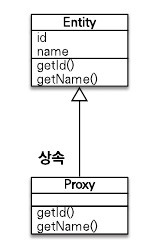

프록시 색체는 실제 객체에 대한 참조를 보관한다.  프록시 객체의 메소드를 호출하면 프록시 객체는 실제 객체의 메소드를 호출한다.

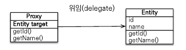

### 프록시 특징

-   프록시 객체는 처음 사용할 때 한번만 초기화된다.
-   프록시 객체를 초기화한다고 프록시 객체가 실제 엔티티로 바뀌는 것이 아닌 프록시 객체를 통해 실제 엔티티에 접근하는 것

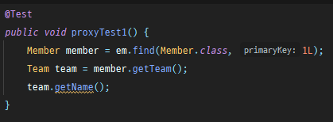

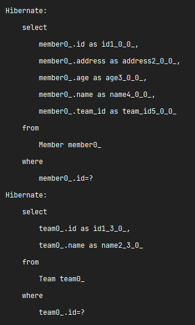

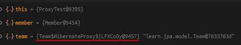

-   프록시 객체는 원본 엔티티를 상속받은 객체이므로 타입 체크 시에 주의
-   영속성 컨텍스트에 찾는 엔티티가 있으면 데이터베이스를 조회할 필요가 없으므로 em.getReference()를 호출해도 프록시가 아닌 실제 엔티티를 반환

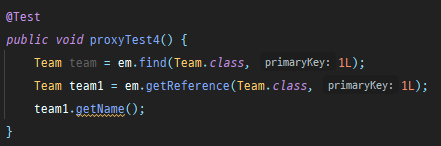

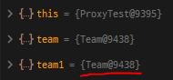

-   초기화는 영속성 컨텍스느의 도움을 받아야 가능.  영속성 컨텐스트의 도움을 받을 수 없는 준영속 상태의 프록시를 초기화하면 LazyInitializationException 발생

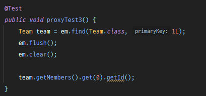

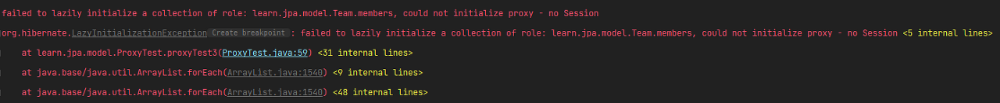

### 프록시와 식별자
엔티티를 프록시로 조회할 때 PK 값을 파라미터로 전달하는데 프록시 객체는 이 식별자 값을 보관한다.


연관관계를 매핑할 때는 엔티티의 PK를 이용해서 매핑을 한다.  프록시 객체는 PK를 갖고 있으므로 연관관계를 설정 할 때 초기화되지 않는다.


### 프록시 확인

JPA가 제공하는 PersistenceUnitUtil.isLoaded(Object entity) 메소드를 사용하면 프록시 인스턴스 초기화 여부를 확인할 수 있다.  이미 초기화되었거나 프록시 인스턴스가 아니면 true를 리턴한다.

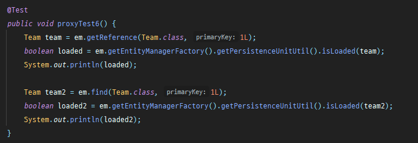

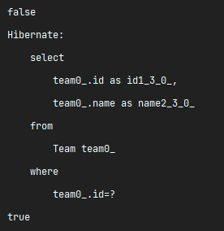

---

## 즉시 로딩과 지연로딩

프록시 객체는 주로 연관된 엔티티를 지연로딩 할 때 사용한다.

-   즉시 로딩 : 엔티티를 조회할 때 연관된 엔티티로 함께 조회한다.
-   지연 로딩 : 연관된 엔티티를 실제 사용할 때 조회한다.

### 즉시 로딩

ToMany 관계의 즉시로딩

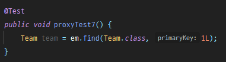

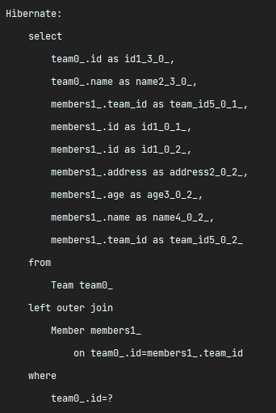

ToOne 관계의 즉시 로딩

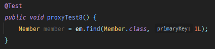

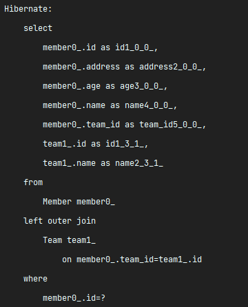

> Null 제약조건과 JPA 조인 전략
>
> 위에서 즉시 로딩 실행 SQL에서 JPA가 내부조인이 아닌 외부조인이 일어났다.  현재 회원 테이블에 team\_id 외래키는 null값을 허용하고 있다.  따라서 팀에 소속되지 않은 회원이 있을 가능성이 있어서 left outer join을 실행했다.
>
> 외래키에 not null 제약조건을 설정하면 내부조인을 사용한다.  
> 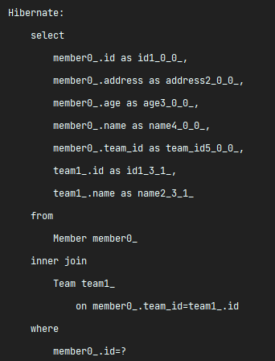
### 지연 로딩

ToMany 관계의 지연 로딩

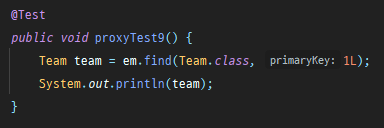

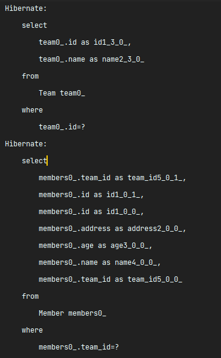

ToOne 관계의 지연 로딩

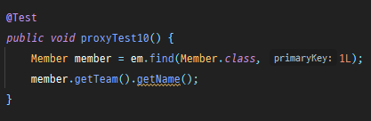

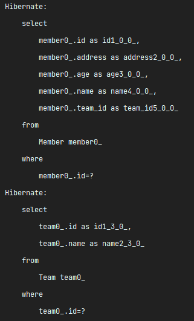

### JPA 기본 페치 전략

-   @ManyToOne, @OneToOne : 즉시 로딩
-   @OneToMany, @ManyToMany : 지연 로딩

### 컬렉션에 즉시로딩 사용시 주의 점

-   컬렉션을 2개 이상의 컬렉션을 즉시 로딩으로 설정하는 것은 권장하지 않음 -> 너무 많은 데이터가 한번에 조회됨
-   컬렉션 즉시로딩은 항상 외부 조인을 사용한다 -> 내부조인 사용 시 회원이 한명도 없는 팀은 조회되지 않음

### 영속성 전이 (CASCADE)

JPA에서 처리하는 Entity의 상태에 따라 종속적인 객체들의 영속성도 함께 처리되는 것이며 총 5개의 옵션이 있다.

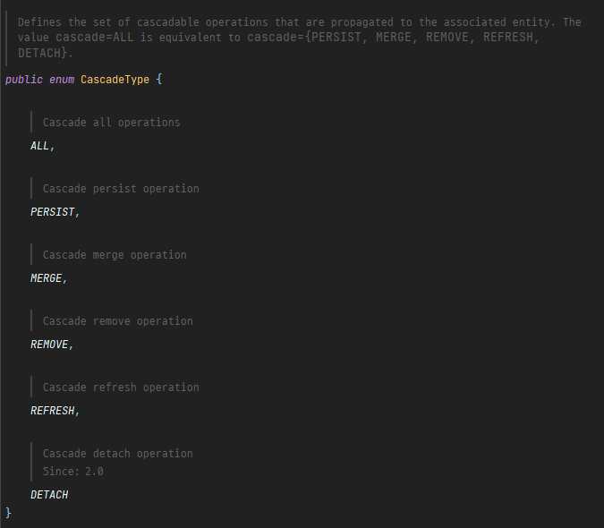

테스트에 사용할 Entity들은 Team과 Member이며 OneToMany로 양방향 매핑되어있다.

```
@Entity
public class Team {
    @Id
    @GeneratedValue
    @Column(name = "team_id")
    private Long id;

    private String name;

    @OneToMany(mappedBy = "team")
    List<Member> members = new ArrayList<>();
    
    ...
}
```

```
@Entity
public class Member {
    @Id
    @GeneratedValue
    @Column(name = "member_id")
    private Long id;
    private String username;
    private int age;

    @ManyToOne(fetch = FetchType.LAZY)
    @JoinColumn(name = "team_id")
    private Team team;
    
    ...
}

```

## PERSIST

Persist옵션은 Entity가 persist될 때, 즉 save될 때 동작한다.  먼저 Casecade 옵션 없이 테스트해보겠다.

```
@SpringBootTest
@Transactional
class CascadeTestApplicationTests {

    @Autowired
    EntityManager em;

    @Test
    public void testEntity() {
        Team teamA = new Team("teamA");
        Team teamB = new Team("teamB");
        Member member1 = new Member("member1", 10, teamA);
        Member member2 = new Member("member2", 20, teamA);
        Member member3 = new Member("member3", 30, teamB);
        Member member4 = new Member("member4", 40, teamB);
        teamA.getMembers().addAll(List.of(member1, member2));
        teamB.getMembers().addAll(List.of(member3, member4));
        em.persist(teamA);
        em.persist(teamB);
        //초기화
        em.flush();
        em.clear();
        //확인

        System.out.println("===========================================================================================================");
        List<Team> teams = em.createQuery("select t from Team t", Team.class).getResultList();
        teams.forEach(System.out::println);
        List<Member> members = em.createQuery("select m from Member m", Member.class).getResultList();
        members.forEach(System.out::println);
        System.out.println("===========================================================================================================");
    }
}

```

두개의 Team에 각각 2명의 Member를 매핑해 주었다.  그리고 persist는 Team에만 해준다.  이렇게 된 경우 Member들은 저장되지 않는다.

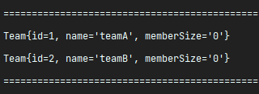

그래서 Member는 조회되지 않았고 Team에 매핑한 Member들도 전혀 저장되지 않은 상태이다.

```
@Entity
public class Team {
    @Id
    @GeneratedValue
    @Column(name = "team_id")
    private Long id;

    private String name;

    @OneToMany(mappedBy = "team", cascade = CascadeType.PERSIST)
    List<Member> members = new ArrayList<>();
    
    ...
}
```

반대로 Team의 members에 Persist 옵션을 넣어서 테스트 해보자.  테스트코드는 동일하며 결과를 확인해보면 Member들이 저장된 것을 확인할 수 있다.

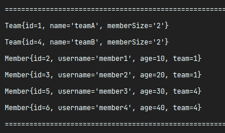

Persist 옵션으로 Team에 연관된 Member들도 연속성 전이를 일으키며 같이 저장된 상태이다.

## REMOVE

Remove 옵션은 Entity가 삭제될 때 작동한다.

```
@SpringBootTest
@Transactional
class CascadeTestApplicationTests {

    @Autowired
    EntityManager em;

    @Test
    public void testEntity() {
        Team teamA = new Team("teamA");
        Team teamB = new Team("teamB");
        Member member1 = new Member("member1", 10, teamA);
        Member member2 = new Member("member2", 20, teamA);
        Member member3 = new Member("member3", 30, teamB);
        Member member4 = new Member("member4", 40, teamB);
        teamA.getMembers().addAll(List.of(member1, member2));
        teamB.getMembers().addAll(List.of(member3, member4));
        em.persist(teamA);
        em.persist(teamB);
        //초기화
        em.flush();
        em.clear();
        //확인

        System.out.println("===========================================================================================================");
        List<Team> teams = em.createQuery("select t from Team t", Team.class).getResultList();
        teams.forEach(System.out::println);
        List<Member> members = em.createQuery("select m from Member m", Member.class).getResultList();
        members.forEach(System.out::println);
        System.out.println("===========================================================================================================");

        em.remove(teams.get(0));
        em.flush();
        em.clear();

        List<Team> teams2 = em.createQuery("select t from Team t", Team.class).getResultList();
        teams2.forEach(System.out::println);
        List<Member> members2 = em.createQuery("select m from Member m", Member.class).getResultList();
        members2.forEach(System.out::println);
        System.out.println("===========================================================================================================");
       }
}
```

위에서 사용한 테스트 코드에 가져온 팀중 첫번 째 팀을 삭제하고 다시 조회를 하였다.  현재는 cascade 옵션이 없는 상태기 때문에 이 코드를 실행하면 flush때 예외가 발생한다.

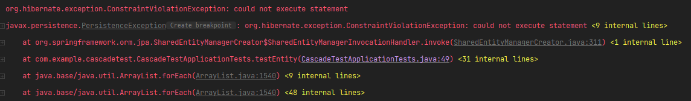

Team은 삭제되었지만 연관되있는 Member에 대한 처리가 없기 때문이다.  이 코드가 동작하게 만들려면 Team에 연관된 Member들도 같이 삭제해줘야 한다.

```
teams.get(0).getMembers().forEach(member -> em.remove(member));
```

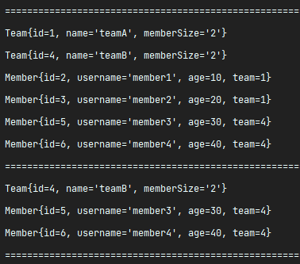

반대로 Cascade 옵션을 REMOVE로 설정하고 테스트 해보자.  REMOVE 옵션을 준 경우 별도로 Team에 연관된 Member들을 명시적으로 삭제하지 않더라도 자동으로 삭제가 가능하다.

```
@Entity
public class Team {
    @Id
    @GeneratedValue
    @Column(name = "team_id")
    private Long id;

    private String name;

    @OneToMany(mappedBy = "team", cascade = CascadeType.REMOVE)
    List<Member> members = new ArrayList<>();
    
    ...
}
```

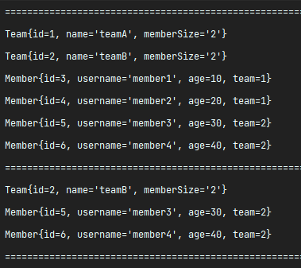

---

## OrphanRemoval

Cascade 옵션에 REMOVE를 넣지 않아도 연관된 객체를 삭제할 수 있는 방법중에 하나다.  이 옵션의 경우 Team을 삭제하게 되면 Member에 연관된 Team이 없어짐으로 Member는 주인 없는 고아객체가 되버린다.  이 옵션을 활성화 하면 고아객체가 된 객체들을 자동으로 삭제해준다.  기본값은 false로 되어있으며 true로 바꿔서 활성화 할 수 있다.

```
@Entity
public class Team {
    @Id
    @GeneratedValue
    @Column(name = "team_id")
    private Long id;

    private String name;

    @OneToMany(mappedBy = "team", orphanRemoval = true)
    List<Member> members = new ArrayList<>();
}
```

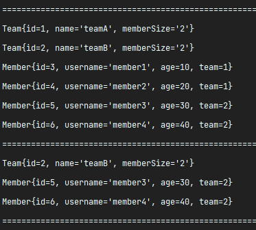

마찬가지로 정상적으로 삭제되는 것을 확인할 수 있다.